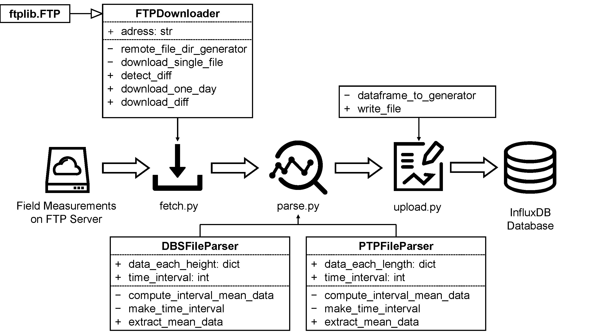
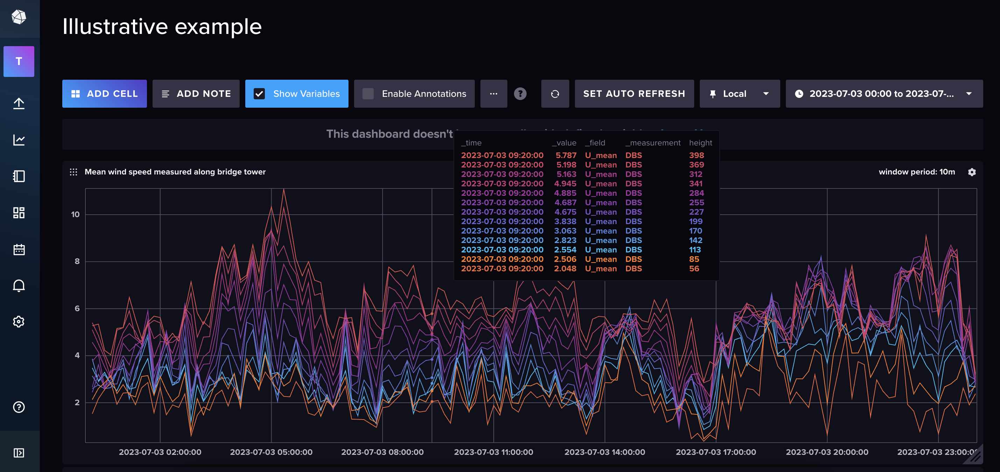

# PyWindAM

A Python software for wind field analysis and cloud-based data management.

## Software Architecture



## Software Usage

### InfluxDB Service

First you need to install the `influxdb` service, here it is recommended to run it in `docker`:
```bash
docker run -d -p 8086:8086 \
      -v $PWD/data:/var/lib/influxdb2 \
      -v $PWD/config:/etc/influxdb2 \
      -e DOCKER_INFLUXDB_INIT_MODE=setup \
      -e DOCKER_INFLUXDB_INIT_USERNAME=<USERNAME> \
      -e DOCKER_INFLUXDB_INIT_PASSWORD=<PASSWORD> \
      -e DOCKER_INFLUXDB_INIT_ORG=<ORGNAME> \
      -e DOCKER_INFLUXDB_INIT_BUCKET=<BUCKETNAME> \
      -e DOCKER_INFLUXDB_INIT_ADMIN_TOKEN=<TOKEN> \
      --name <CONTAINERNAME> \
      influxdb:2.7
```
Note the replacement of `<VARNAME>` with a user-defined name.

### Python Package

Install the package dependencies:
```bash
pip install -r requirements.txt
```

Create the `config.py` file and fill in the configurations according to the user information of the `influxdb` and `ftp` services
```bash
# ftp
FTP_ADDRESS = ""
FTP_USERNAME = ""
FTP_PASSWORD = ""
REMOTE_ROOT = "/3D6000-060/"
LOCAL_ROOT = "../data_download_from_ftp/"
WORKING_TIME = "00:00:00"
SLEEPING_TIME = "23:59:59"
DATE_START = "20230401"

# bridge attributes
MAX_HEIGHT = 500
MAX_LENGTH = 2000
INTERVAL = 600
BRIDGE_ALIGN = 40

# influxdb
DBURL = "http://localhost:8086"
USERNAME = ""
TOKEN = ""
ORG = ""
BUCKET = ""
BATCH_SIZE = 500
```
Note for local usage, the `FTP_ADDRESS`, `FTP_USERNAME`, `FTP_PASSWORD`, `REMOTE_ROO` and `LOCAL_ROOT` can be left blank.

### Run the software

For complete usage, an `FTP` service on the measurement equipment is required. Field measurements will be automatically downloaded from the `FTP` service, then the wind field parameters will be calculated and stored in the `influxdb` service.

Run the `main.py` file to start the software service
```bash
python main.py
```
Or you can run the service using the no-hangup command
```bash
nohup python main.py &
```

If the `FTP` service is not available, we provide a demo data set in the `data_download_from_ftp` folder. You can run the `local_mode.py` file to start the software service.
```bash
python local_mode.py --end_day 20230404
```

Then accessing port 8086 under the server or the local address through your browser will show you the constantly updated wind parameters.


